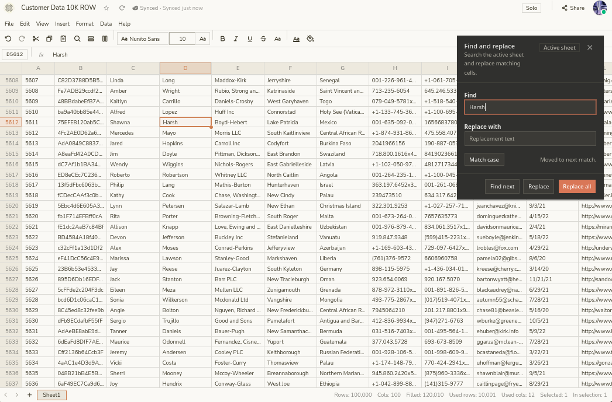
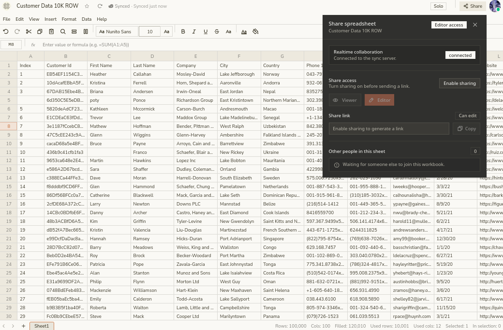
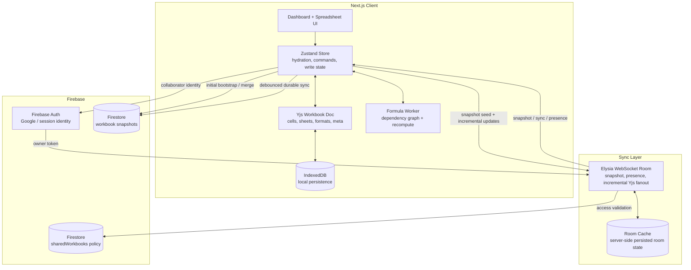

## Papyrus

Realtime collaborative spreadsheet with a local-first document model, CRDT-based syncing, worker-driven evaluation, and a virtualized grid built to stay responsive on 10K+ row datasets.

### Links

- Full Feature List: [features](https://github.com/parazeeknova/papyrus/wiki/Features) at github wiki !
- Live app: [vercel](https://papyrus-sheets.vercel.app) link deployed
- Shared 10K row workbook: [shared - editor access](https://papyrus-sheets.vercel.app/workbook/8a8dd4da-b5ae-4076-a432-0402b3da8208?shared=1)
- Loom Video: [video](https://www.loom.com/share/6a8a305a52a9422fbea79584c5a9cd72)

| Home | Find & Replace | Share menu |
| --- | --- | --- |
|  |  |  |

### Core

- The workbook is modeled as a Yjs document, so cells, sheets, formats, column metadata, and workbook metadata all live in one conflict-tolerant source of truth.
- The web client is local-first: IndexedDB persists workbooks for instant reloads, while Firestore acts as the durable cloud snapshot and sharing registry.
- Realtime collaboration is handled by an Elysia WebSocket service that sends room snapshots on join and incremental Yjs updates after that.
- Presence is intentionally separate from workbook state. Active users, selections, typing state, and viewer/editor access are transported as ephemeral collaboration metadata.
- Formula support is deliberately shallow and defendable for assignment scope: cell refs, ranges, arithmetic, and `SUM`, `AVERAGE`, `MIN`, `MAX`, `COUNT`.
- Large-sheet responsiveness comes from sparse cell storage, TanStack row and column virtualization, and a Web Worker that recalculates formulas off the main thread.

### Architecture

### More Info

- Logical row capacity is `100,000`, with the visible window virtualized instead of rendering the full sheet into the DOM.
- A 10K+ row CSV is a strong path for this architecture because import stores only populated cells, the grid renders only visible rows and columns, and recalculation stays off the main React thread.
- The live collaboration path and the durable cloud path are intentionally split: Yjs + WebSocket handles low-latency edits and conflict-friendly merging, while Firestore handles debounced persistence, durable restore, and sharing metadata.
- Firestore writes are lease-guarded to reduce remote snapshot clobbering when multiple authenticated clients are open on the same workbook.
- Structural operations like insert, delete, and reorder are supported, but they are heavier than plain editing because they rewrite sparse cell maps and formula references.
